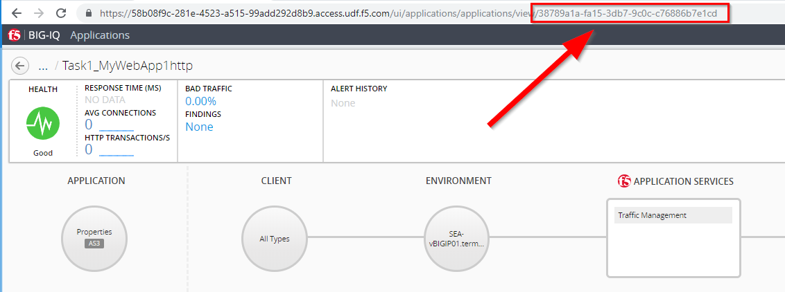

Lab 5.6: Enable/Disable Enhanced Analytics on BIG-IQ
----------------------------------------------------

Using Postman, use the **BIG-IQ Enable/Disable Enhanced Analytics** collection in order to turn on the Enhanced Analytics on a specific Application Service.

Replace the **<uuid-of-config-set>** with the appropriate value.

.. note:: The <uuid-of-config-set> can be retrived from the BIG-IQ |lab-6-1|

Copy/Paste the below BIG-IQ JSON into the body (Postman):

   POST https://10.1.1.4/mgmt/cm/global/tasks/set-application-analytic-mode

.. code-block:: yaml
   :linenos:
   :emphasize-lines: 3

    {
        "configSetReference":{
            "link":"https://localhost/mgmt/cm/global/config-sets/<uuid-of-config-set>"
        },
        "analyticsMode":"ENHANCED",
        "options":[
            "COLLECT_GEO",
            "COLLECT_METHOD",
            "COLLECT_OS_AND_BROWSER",
            "COLLECT_SUBNET",
            "COLLECT_URL",
            "COLLECT_IP",
            "COLLECT_SECURITY_DATA"
        ],
        "ipsForStatCollection":[]
    }

To turn it off, POST:

.. code-block:: yaml
   :linenos:
   :emphasize-lines: 3

    {
    "configSetReference":{
        "link":"https://localhost/mgmt/cm/global/config-sets/<uuid-of-config-set>"
    },
    "analyticsMode":"NORMAL"
    }

Or turn it on/off directly within your AS3 declaration:

.. code-block:: yaml
   :linenos:
   :emphasize-lines: 3

    "statsProfile": {
         "class": "Analytics_Profile",
         "collectedStatsInternalLogging": true/false,
          ...
    },

