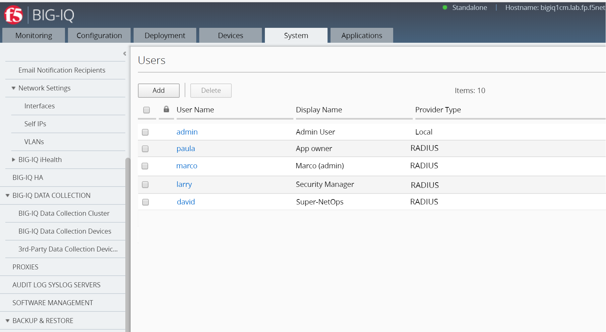

Lab 1: Creation of each personas in BIG-IQ
--------------------------------------------
.. note:: Marco, Paula and Larry are already created in the blueprint except **David**.

We will be using 4 main personas for this lab:

1. **Marco**: Full Administrator
2. **David**: Super-NetOps
3. **Larry**: Application Security Manager
4. **Paula**: Application Manager, Paul: Application Owner

**Marco** will have full access to BIG-IQ. He knows a lot about F5 products (BIG-IQ/BIG-IP).
He will provide the access to David, Larry and Paula. He will also manage the Service Scaline Group (SSG)
and application templates.

**Larry** will manage the Web Application Firewall (WAF) policies. He will work with Paula's team
to define the necessary security policies for each applications.
Ensure teams comply with security policies, industry rules and regulations, and best practices.
Keeping up to date on threats, determining their potential impact, and mitigating the risks.

**Paula** will manage the application deployments, monitor levels of app incidents, building solutions to address identified, prioritized business problems in a timely manner.
Maximizing value of app through capabilities design, adoption, and usage.
Ensuring that the app fits within the rest of the organization’s app portfolio strategy.
Paul is in Paula's team and will manage only a subset of applications.

**David** will try automating whenever possible, to enable efficiency and ability to solve problems at scale.
Automate common network patterns that the other teams can consume.
Automate existing environment management and troubleshooting tasks.

Connect to your BIG-IQ as **admin** and go to : *System* > *Users Management* > *Users*
and click on *Add*

**1. Marco: Full Administrator**

- *Auth Provider* = Radius
- *User Name* = marco
- *Full Name* = Full Administrator
- (*Password stored in Radius server* = marco)
- *Role* = Administrator Role

Click on *Save & Close*

**2. Larry: Application Security Manager**

Click on *Add*

- *Auth Provider* = Radius
- *User Name* = larry
- *Full Name* = Application Security Manager
- (*Password stored in Radius server* = larry)
- *Role* = Security Manager

Click on *Save & Close*

**3. Paula: Application Manager**

Click on *Add*

- *Auth Provider* = Radius
- *User Name* = paula
- *Full Name* = Application Manager
- (*Password stored in Radius server* = paula)
- *Role* = Application Manager

Click on *Save & Close*

**4. David: Super-NetOps**

Click on *Add*

- *Auth Provider* = local
- *User Name* = david
- *Full Name* = Super-NetOps
- *Password* = david
- *Role* = Application Manager

Click on *Save & Close*`

.. warning:: Only local users are supported to execute Ansible playbook

