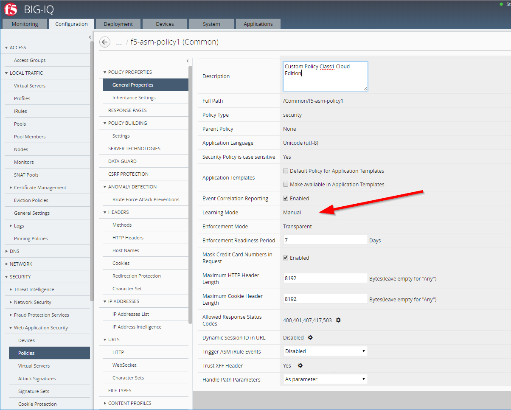
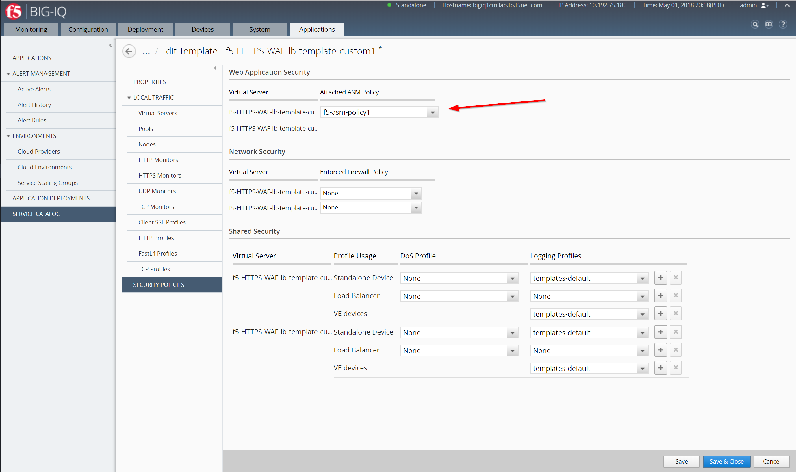

Lab 2.2: Create custom security policies & Application Service Template
-----------------------------------------------------------------------
Connect as **larry** to create the custom ASM policy, go to *Configuration* > *SECURITY* > *Web Application Security* > *policies*.

Import the ASM policy `ASM Policy`_.

.. _ASM Policy: ../file/Common_viol_subviol__2018-04_25__10-19.xml

.. image:: ../pictures/module2/img_module2_lab2_2.png
  :align: center
  :scale: 50%

The policy is imported in Transparent mode.

.. image:: ../pictures/module2/img_module2_lab2_3.png
  :align: center
  :scale: 50%

Edit the Policy, switch to ``Manual`` Learning Mode and ``Make available in Application Templates``. Save & Close.

In addition, go to *POLICY BUILDING* > *Settings* and set *Policy Building Mode* to ``Central``. Save & Close.

Create the AFM Policy, go to *Configuration* > *SECURITY* > *Network Security* > *Firewall Policies*, Create.
Then enter the name of your policy: ``f5-afm-policy1``. Make sure the box ``Make available in Application Templates`` is checked. Save & Close.

.. image:: ../pictures/module2/img_module2_lab2_5.png
  :align: center
  :scale: 50%

Create a Rules, set the destination ports to ``443`` and ``80``, Protocol to ``tcp`` and Save & Close.

.. image:: ../pictures/module2/img_module2_lab2_6.png
  :align: center
  :scale: 50%

Connect as **marco** to create a Clone of the *Default-f5-HTTPS-WAF-lb-template* policy, go to *Applications* > *SERVICE CATALOG*, and click on *Clone*.
Enter the name of your cloned template: ``f5-HTTPS-WAF-lb-template-custom1``

Then select the ASM policy ``viol_subviol``, the AFM policy ``f5-afm-policy1`` and the Logging Profile ``templates-default`` to both virtual servers (Standalone Device).

Save & Close

.. note:: A DoS Profile could also be assign to the template but we are not using it for this lab.

.. warning:: Application DOS is only supported on Standalone device. The Network DOS is supported on Standalone and Tier 1 device (in a context of SSG)
