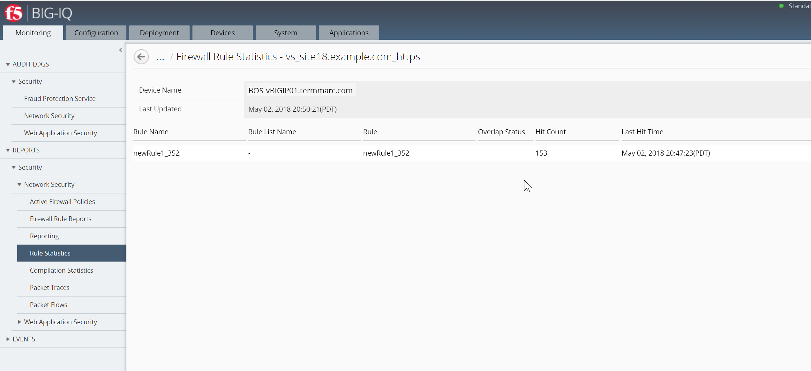
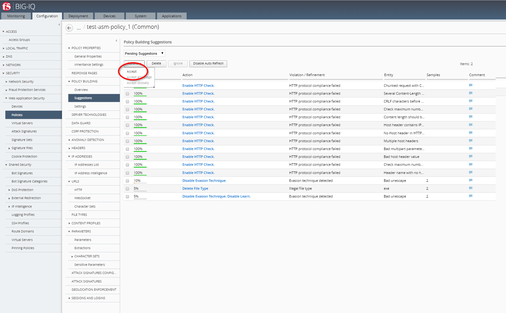
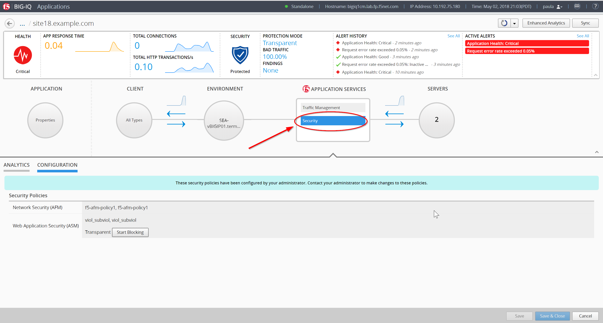
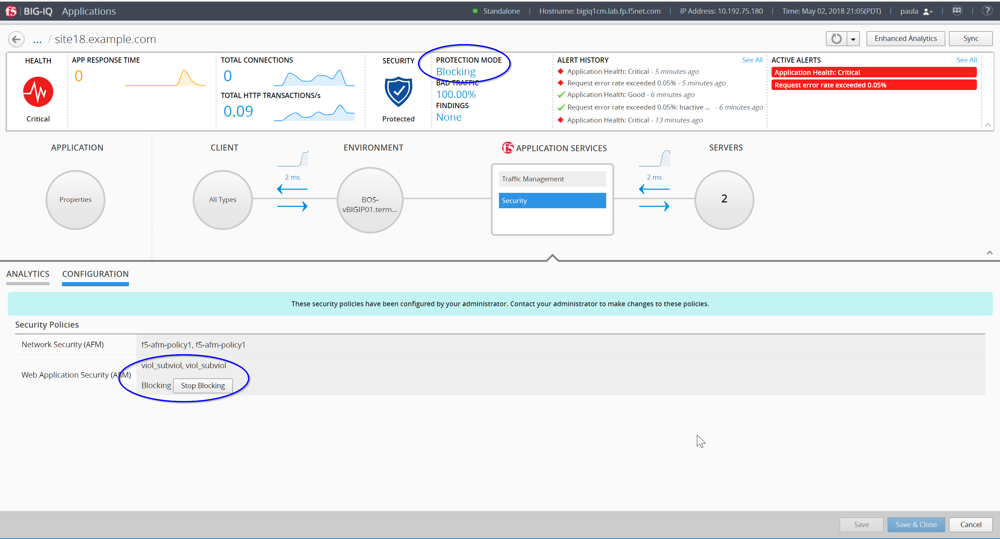
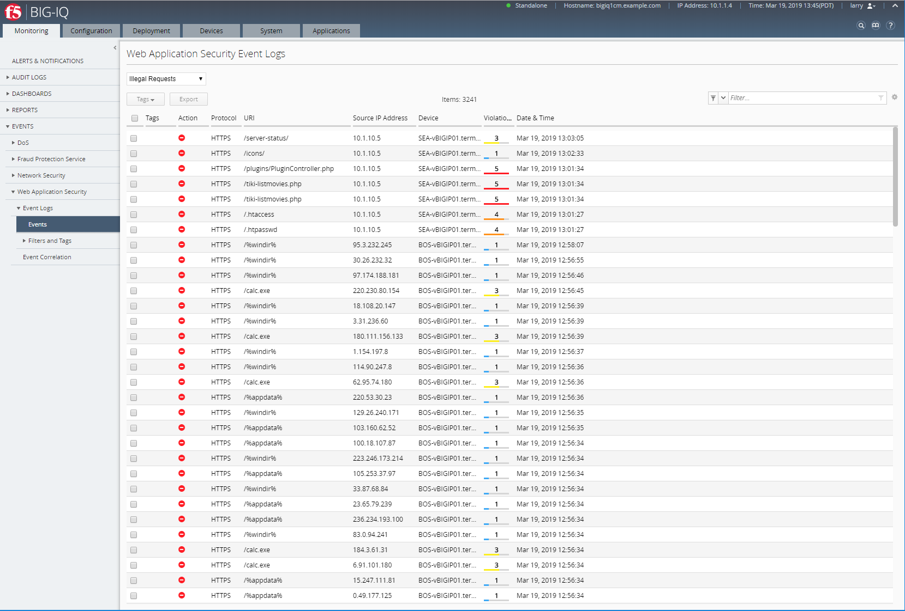

Lab 2.4: Security workflows
---------------------------
Connect as **larry**

1. Larry check the Firewall policy.

Go to Monitoring > REPORTS > Security > Network Security > Rule statistics and select
*vs_site18.example.com_https* SEA-vBIGIP01.termmarc.com

|

2. Larry check the Web Application Security for ``viol_subviol`` ASM Policy.

Go to Configuration > SECURITY > Web Application Security > Policies

Click  on Suggestions, then Accept the Learning.

|

3. Update the Enforcement Mode to ``Blocking``.

.. image:: ../pictures/module2/img_module2_lab4_4.png
  :align: center
  :scale: 50%

|

Connect as **paula**

Select ``site18.example.com``

1. Paula enforce the policy APPLICATION SERVICES > Security > CONFIGURATION tab > click on ``Start Blocking``

|

|

2. Let's generate some bad traffic, connect on the *Ubuntu Lamp Server* server and launch the following script:

``# /home/f5/scripts/generate_bad_traffic.sh``

3. In Application Dashboard, navigate to the Security Statistics and notice the Malicious Transactions.

Connect as **larry**

1. Check ASM type of attacks

Monitoring > EVENTS > Web Application Security > Event Logs > Events

2. Stop the bad traffic script, connect on the *Ubuntu Lamp Server* server and ``CTRL+C``.
