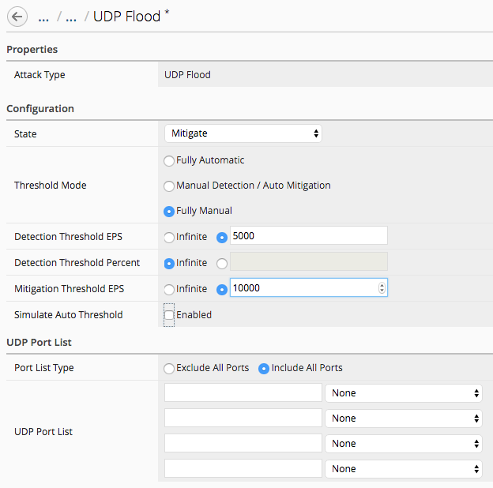
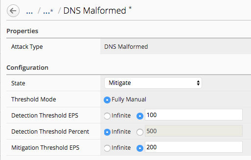

Lab 2.1: Configuring DoS Device Profile
---------------------------------------

The Devic DoS profile reports and mitigates based on aggregated data across the entire BIG-IP. All packets that are not explicitly white listed
count for the Device DoS vectors. When using more specific profiles on Virtual Servers, the Device DoS profile should be set using values large
enough that they provide protection for the device without conflicting with Virtual Server profiles. For example individual virtual servers may be 
configured with UDP flood values of detect and mitigate values of 10000 PPS, however device DoS is set to 50000 PPS. 

.. note:: Most DoS Vector values are *per TMM*, with the exepction being Single Endpoint Sweep and Flood vectors which aggregate multiple packet
types and count across all TMMs. 

For this set of labs we will be utilizing Device DoS to detect and mitigate bad packet and flood types, while using a DoS Profile to detect and mitigate 
specific DNS vectors only. This allows us to layer on a granual DNS policy while letting Device DoS catch bad packet types across all Virtuals. 

The default DoS manual detect and mitigate settings are high for all vectors. To simplify any demo, reducing them allows for easier demonstractions. 
If using a lab VE license the 10 Mb/s limit will make demonstrations challenging: its suggested to use demo licenses of at least 1Gb/s when possible. 

1. Under *Configuration* > *Shared Security* > *Device DoS Configurations*, click on *BOS-vBIGIP01*
2. Expand the *Flood* category of attacks
3. Select *UDP Flood* and modify the settings as shown below: be sure UDP port list includes all ports (a white listed port will not be counted)

4. Expand the *DNS* category of attacks
5. Select *DNS Malformed* and modify the settings as shown below

6. Click *Save & Close* to save all the DoS Profile edits to BIG-IQ
7. To deploy the changes, create and deploy using *Shared Security* or *Network Security* 