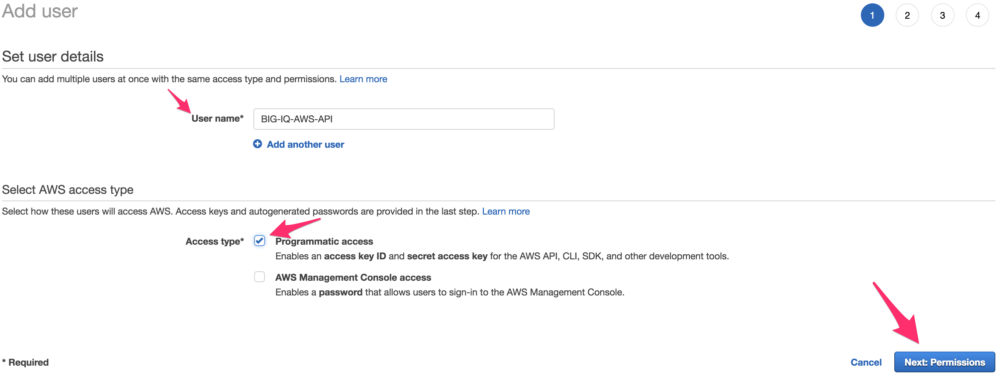
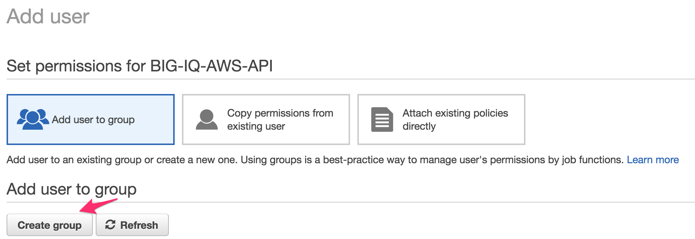
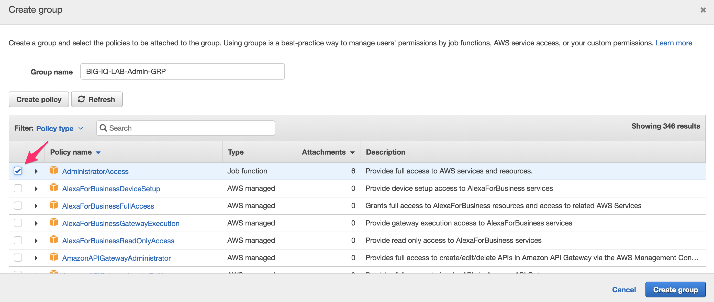
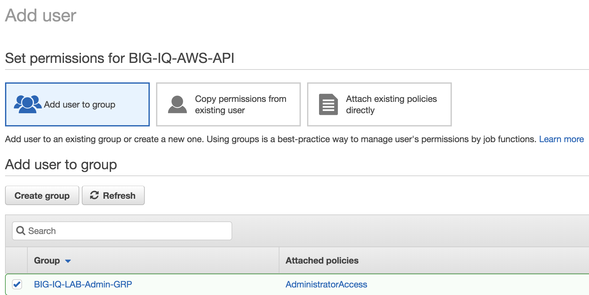
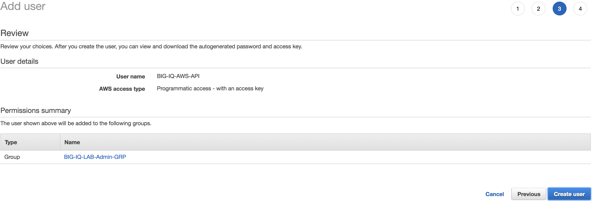
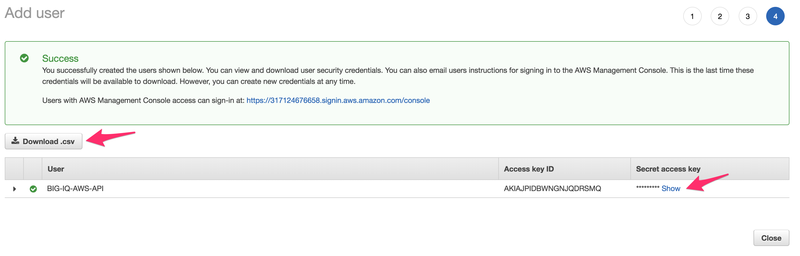
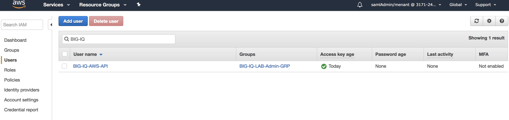
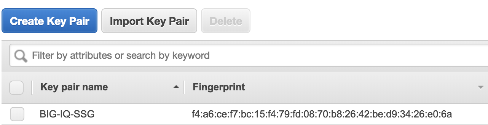

Lab 4.1: Prepare our ``AWS`` deployment 
---------------------------------------

In module1/Lab 1.1, we saw the different components to setup a SSG: 

* ``License Pool`` 
* ``IP Pools``
* ``Device Template``
* ``Cloud Provider``
* ``Cloud Environment``

When you want to deploy a ``SSG`` in ``AWS``, you don't need to provide the same amount of information:

* A ``License Pool`` is not mandatory. We are free to use ``Utility Billing`` (pay-per-use) in ``AWS``
* ``IP Pools`` are not needed. When we deploy a ``SSG`` in ``AWS``, the deployed ``Virtual Edition(s)`` 
  we be using our single NIC deployment. It means that we use one interface for management and traffic 
  processing. In this case, the IP Address assigned to the device will be picked automatically by ``AWS```


To deploy our ``SSG``in ``AWS``, we will need to do a few things: 

* Pick a ``AWS Region``
* Setup an ``IAM`` resource (Identity and Access Management) that will allow us to setup our ``SSG`` via 
  the ``AWS`` API
* Setup a ``Key Pair`` in the selected ``AWS Region``

Once this is done, we will be able to deploy our ``SSG``. We will rely on some ansible scripts to: 

* Create a VPC, subnets, security groups, ...
* Deploy an APP in ``AWS``
* Setup an ``AWS VPN`` connection between our ``UDF`` environment and this newly deployed ``AWS VPC``

.. note:: in this lab, we consider that you have access to ``AWS``. We won't cover this topic. 

Create a new ``IAM`` Resource
*****************************

To create a new ``IAM`` in ``AWS``, go to **Services** > **IAM**

.. image:: ../pictures/module4/img_module4_lab1_1.png
  :align: center
  :scale: 50%

|

Click on **Users** > **Add user** 

.. image:: ../pictures/module4/img_module4_lab1_2.png
  :align: center
  :scale: 50%

|

Set the following information: 

* User Name: BIG-IQ-AWS-API
* Access type: Check **Programmatic access** 



|

Click on the button **Next: Permissions**

On the Permissions page, click on the button **Create group**



|

* Group name: BIG-IQ-LAB-Admin-GRP
* Policy : Check the box for **Administrator Access**



|

Click on **Create group**. 

.. note:: this is not the best suited group for BIG-IQ access but this lab is not about covering ``IAM`` 
  setup. We could just create a policy that allows us to run CFT, Setup VPC/VPN and launch EC2 instances



|

Make sure your new group **BIG-IQ-LAB-Admin-GRP** is selected, **SCROLL DOWN** and click on the button 
**Next: Review**. You should see a page like this: 



|

Click on the button **Create user**. 

.. warning:: DON'T leave this summary page until you've taken note of your credentials ! You 
  can't get those back once you'll leave this page



|

You need to store your ``Access key ID`` and your ``Secret Access key``. 2 methods: 

* You click on the button **download .csv** 
* You click on **show** in the ``Secret Access key`` column and then you store yourself somewhere 
  your ``Access key ID`` and your ``Secret Access key``

Click on the **Close** button once you've save your credentials. 



|

Now that our ``IAM`` resource is created, we can create our AWS ``key pair``. 

Create a new AWS ``key pair``
*****************************

Before creating our ``key pair``, we need to select a region where we will deploy our ``SSG``. 
For this lab, we will use the region ``us-east``. 

In the ``AWS UI``, click on **Services** > **EC2**

.. image:: ../pictures/module4/img_module4_lab1_10.png
  :align: center
  :scale: 50%

|

Select your region: on the top right , click on the selected ``AWS Region`` and select **US East (N. Virginia)

.. image:: ../pictures/module4/img_module4_lab1_11.png
  :align: center
  :scale: 50%

|

Now that we picked the ``AWS Region`` where we will deploy our ``SSG``, we can create our ``Key Pair`` 
(it is only valid for a region)

Go to **Network & Security** , **Key Pairs**. 

.. image:: ../pictures/module4/img_module4_lab1_12.png
  :align: center
  :scale: 50%

|

Click on **Create Key Pair**

* Key pair name: BIG-IQ-SSG 



|

We have now setup everything our ``IAM`` resource and our ``Key Pair``. We can work on deploying our 
``SSG``.

Subscribe to the BIG-IP instance in the ``AWS MArketplace``
***********************************************************

Before being able to deploy an instance in ``AWS``, you'll have to **subscribe** to this license agreement

Go here to **subscribe** to right F5 instance we will use in this lab: 

`F5 BIG-IP Virtual Edition - BEST - (BYOL) <https://aws.amazon.com/marketplace/pp/B00KXHNAPW?qid=1528627067862&sr=0-1&ref_=srh_res_product_title>`_

Once you've subscribed, you should see something like this: 

.. image:: ../pictures/module4/img_module4_lab1_14.png
  :align: center
  :scale: 50%

|


