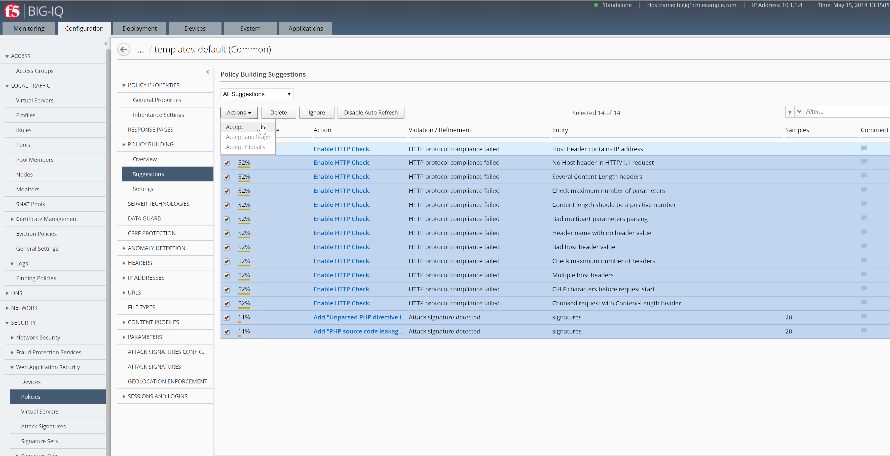

Lab 2.3: Troubleshooting Security
---------------------------------
Connect as **larry**

2. Larry check the Web Application Security for ``templates-default`` ASM Policy.

Go to Configuration > SECURITY > Web Application Security > Policies

Click the box to select all suggestions and **Accept** the learning.

|

3. Update the Enforcement Mode to ``Blocking``, Save and Close.

.. image:: ../pictures/module2/img_module2_lab3_2.png
  :align: center
  :scale: 50%

|

Connect as **paula**

Select ``site36.example.com``

1. Paula enforce the policy: APPLICATION SERVICES > Security > CONFIGURATION tab > click on ``Start Blocking``

.. image:: ../pictures/module2/img_module2_lab3_3.png
  :align: center
  :scale: 50%

|

2. Connect on the *Ubuntu Lamp Server* server and launch the following command:

``# /home/f5/scripts/generate_bad_traffic.sh``

3. Check the various Security Analytics: Illegal Transactions, All Transactions and Violations.

.. image:: ../pictures/module2/img_module2_lab3_4.png
  :align: center
  :scale: 50%
