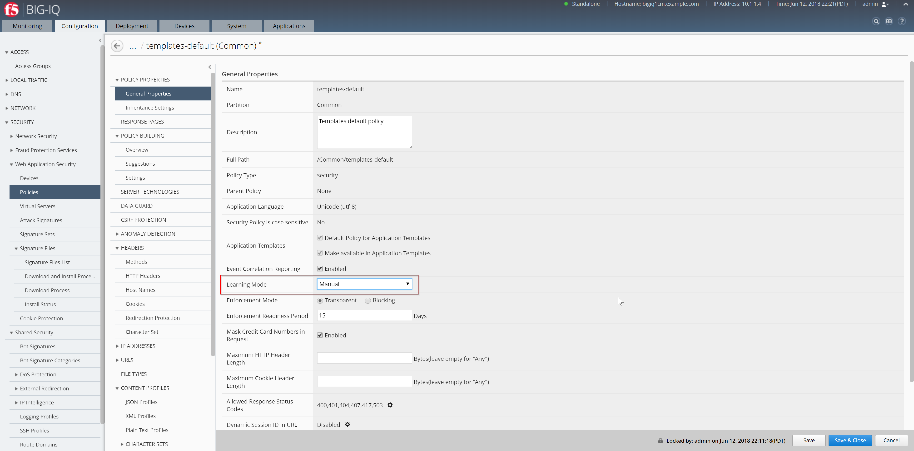
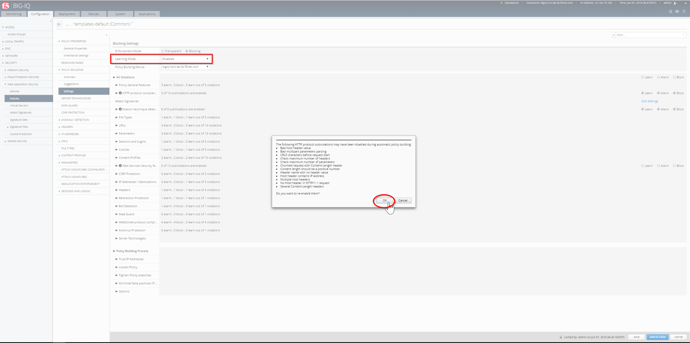
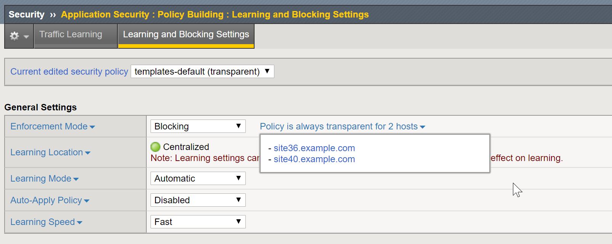

Lab 2.3: Troubleshooting Security
---------------------------------
Connect as **larry**

1. Larry disable the Web Application Security for ``templates-default`` ASM Policy.

Go to Configuration > SECURITY > Web Application Security > Policies, select ``templates-default`` ASM Policy.

Go to POLICY PROPERTIES > General Properties and **Manual** the Learning Mode.

Go to POLICY BUILDING > Settings and **Manual** the Learning Mode. Answer **Ok** to the question

.. note:: The intent for the initial release 6.0 was to be able to push a basic (negative only) security policy that can provide a basic level of protection for most applications. For 6.0, it is recommended that learning shouldn’t be enabled with app templates – it should be a fundamental policy.

|

2. Update the Enforcement Mode to ``Blocking``

Go to POLICY PROPERTIES > General Properties

.. image:: ../pictures/module2/img_module2_lab3_2.png
  :align: center
  :scale: 50%

|

Save and Close.

Connect as **paula**

Select ``site36.example.com``

1. Paula enforce the policy: APPLICATION SERVICES > Security > CONFIGURATION tab > click on ``Start Blocking``

.. image:: ../pictures/module2/img_module2_lab3_3.png
  :align: center
  :scale: 50%

|

.. note:: The Enforcement Mode is controlled by the Application owner, the Host Name of the application (FQDN) will be configured in the ASM Policy to enforce it (or not)

2. Connect on the *Ubuntu Lamp Server* server and launch the following command:

``# /home/f5/scripts/generate_bad_traffic.sh``

3. Check the various Security Analytics: Illegal Transactions, All Transactions and Violations.

.. image:: ../pictures/module2/img_module2_lab3_4.png
  :align: center
  :scale: 50%

4. Stop the bad traffic script, connect on the *Ubuntu Lamp Server* server and ``CTRL+C``.
