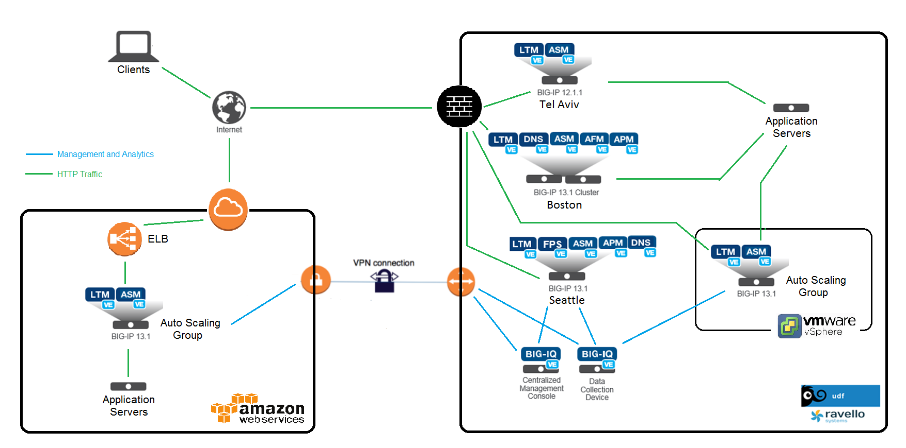

F5 Cloud Edition Lab - Index
============================

Welcome
-------

Welcome to the |classbold| lab - |year|

|repoinfo|

There is lab environment available in UDF and Ravello (Oracle Public Cloud) for internal F5 users as well as Partners (please feel free to contact an `F5 representative`_).

This lab environment is designed to allow for quick and easy demos of a significant portion of the BIG-IQ product.

.. _F5 representative: https://f5.com/products/how-to-buy#3013

**List of instances**:

- BIGIQ <> DCD
- 3x BIG-IP 13.1.0.5 / 1 standalone (Seattle), 1 cluster (Boston)
- 1x BIG-IP 12.1.0 / 1 standalone (Tel Aviv)
- LAMP Server - Radius, DHCP, RDP, Application Server, Traffic Generator (HTTP, ACCESS, DNS, SECURITY).

**Components available**:

- "System" - Manage all aspects for BIG-IQ, 
- "Device"  - Discover, Import and manage BIGIP devices. (ADC scale target 400 devices per BIGIQ instance with the min required resources for virtual), 
- "Configuration" - ADC, Security (ASM config/monitoring, AFM config, FPS monitoring.)
- "Deployment" - Manage evaluation task and deployment.
- "Monitoring" - Event collection per device, statistics monitoring, iHealth reporting integration, alerting, and audit logging.
- "Application" - Application Management (Cloud Edition)

.. toctree::
   :maxdepth: 2
   :numbered:
   :caption: Contents:
   :glob:

   class*/class*
