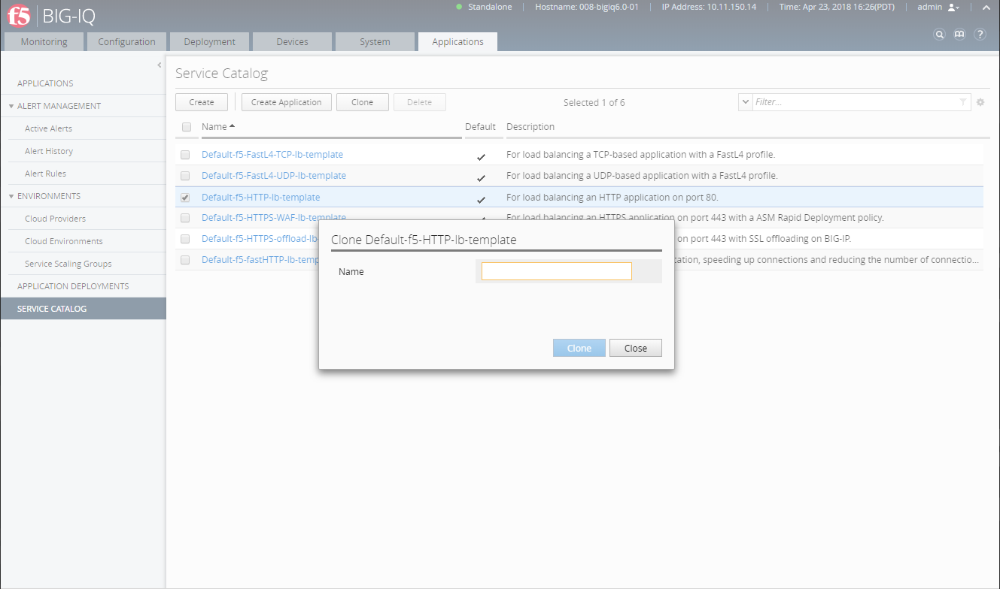

Lab 2.3: Clone Service Template
-------------------------------
Connect as **Marco** to create a Clone, go to *Applications* > *SERVICE CATALOG*, select the profile you want to clone
(e.g. ``Default-f5-HTTP-lb-template``) and click on *Clone*. Then enter the name of your cloned template.

You should see this:

