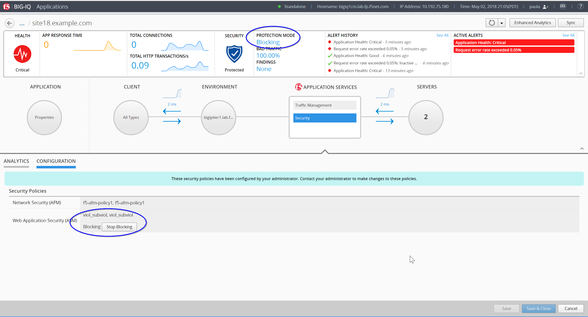

Lab 2.4: Security workflows
---------------------------

- larry enforing the policy, learning etc ...
- paul turn blocking on the app

Connect as **Larry**

1. Larry check the Firewall policy

Monitoring > REPORTS > Security > Network Security > Rule statistics

.. image:: ../pictures/module2/img_module2_lab4_1.png
  :align: center
  :scale: 50%

2. Larry check and accept the Learning, also inform Paula

Configuration > SECURITY > Web Application Security > Policies

Connect as **Paula**

1. Paula enforce the policy

.. image:: ../pictures/module2/img_module2_lab4_4.png
  :align: center
  :scale: 50%

2. Let's generate some bad traffic, connect on the *Ubuntu Lamp Server, LDAP and DHCP* server and launch the following script:

``# /home/f5/scripts/generate_bad_traffic.sh``

3. In Application Dashboard, navigate to the Security Statistics.

Connect as **Larry**

1. Check ASM type of attacks

Monitoring > EVENTS > Web Application Security > Events Logs > Events
