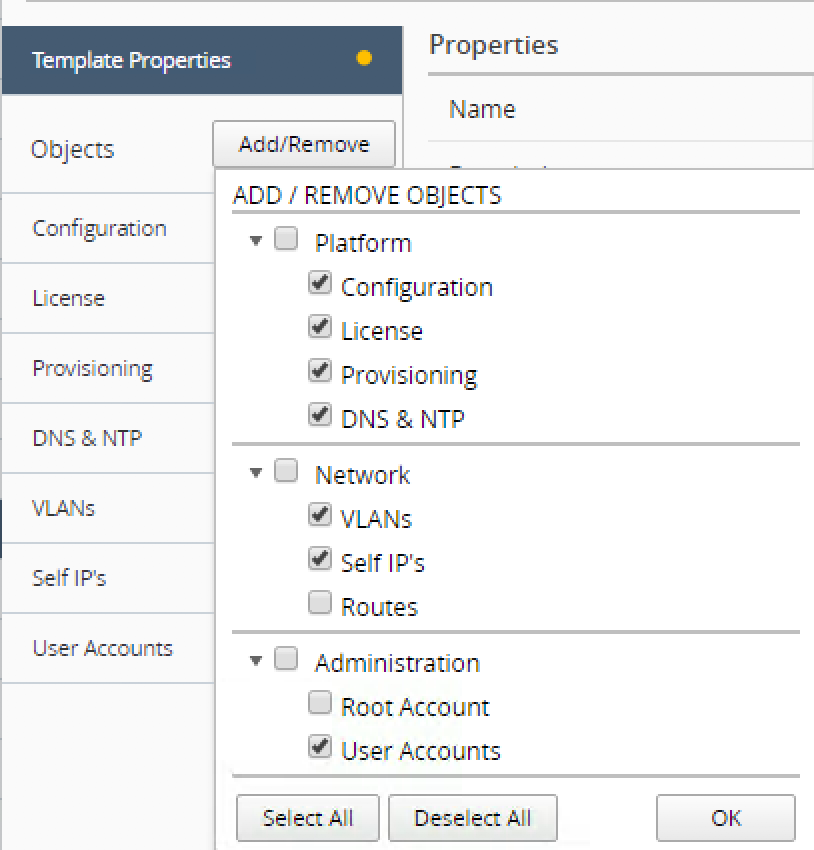
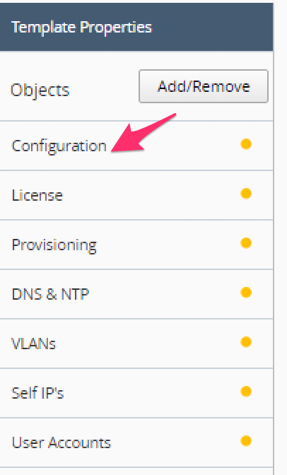
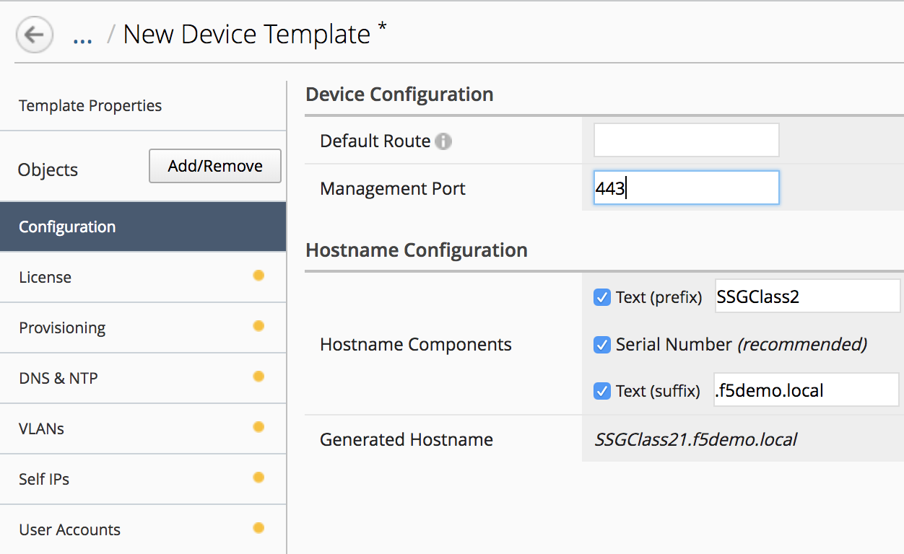
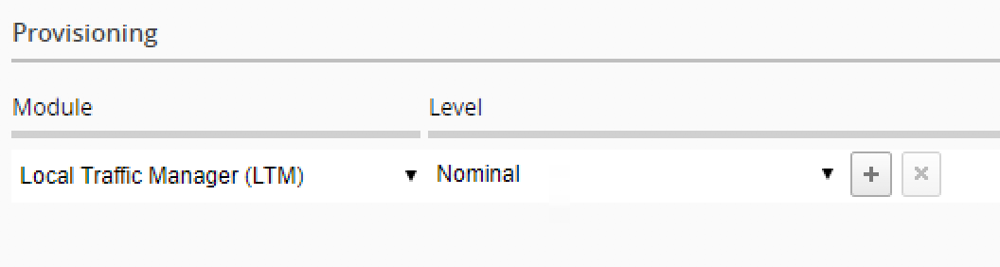
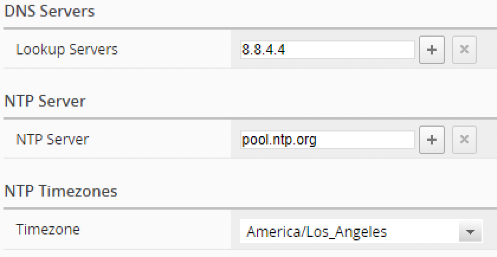
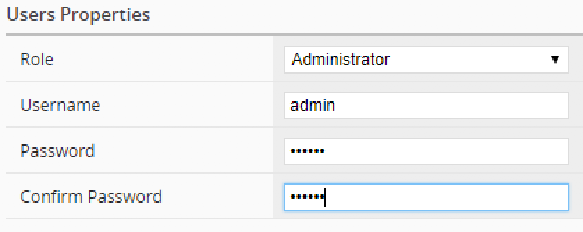

Lab 1.1: Setup a device template
--------------------------------

The first thing to setup to be able to deploy ``Service Scaling Group`` (SSG) is
to setup a ``device template``

A device template contains all the configuration items that should be pushed
on a newly provisioned F5 Virtual edition:

* Hostname (prefix/Serial Number/suffix)
* Default route (if you don't use DHCP)
* Management port (may vary if you use VMWare - 443 - or AWS - 8443 -)
* License
* Modules to provision
* VLANs
* Self-IPs
* User accounts

In this lab, we will create a device template that will be used for our SSG

License Pool Setup
******************

Your BIG-IQ should already have a license pool setup.

Connect to your BIG-IQ and go to : *Devices* > *License Management* > *Licenses*

Here you should see a license pool called

.. warning:: specify the license pool already setup in the blueprint and provide
 also a screenshot of it

IP Pools Setup
**************

When you provision dynamically new F5 virtual edition, you need to be able to
automatically assign Self IPs to this instance. To do that, we will rely on
the ``IP Pool`` feature of BIG-IQ

For our lab, we will need two IP pools:

* One for the network between Tier1 and Tier2
* One for the servers network

Go to *Devices* > *IP POOLS*, Click on *Create*

.. warning:: Setup the IP Pools according to the final Blueprint

Device Template Setup
*********************

To create your Device Template, go to *Devices* > *Device Templates* and click
on *Create*

you should see this:

.. image:: ../pictures/module1/img_module1_lab1_1.png
  :align: center
  :scale: 50%

|

Click on the button *Add/remove* to select the configuration items you want to
enforce when deploy a new F5 virtual edition in your ``SSG``

Select:

* configuration
* License
* Provisioning
* DNS & NTP
* VLANs
* Self IP's
* User accounts

|

Click *OK*. You'll see new tabs under the *Objects* column.

In the Name field, specify your ``Device Template`` name: *SSGSetupClass2*

.. image:: ../pictures/module1/img_module1_lab1_3.png
  :align: center
  :scale: 50%

|

Click on the **configuration** tab , DO NOT CLICK SAVE YET or you'll lose the
unconfigured tabs

|

Setup the configuration tab like this:

* Hostname Components:

  * Check *Text (prefix)* and put: SSGClass2
  * Check *Serial Number*
  * Check *Text (suffix)* and put: .f5demo.local
  * Default route: LEAVE EMPTY
  * Management port: 443

|

Click on the *License* tab and setup the following:

* License Type : Select *Purchase Pool*
* License Name:

.. warning:: Setup the License pool name based on what is in UDF and add a
  screenshot

|

Click on the *Provisioning* tab,

* Select the module *Local Traffic Manager (LTM)*
* Set LTM to a level *Nominal*

|

Click on the *DNS & NTP* tab and setup the following:

* Lookup Servers: 8.8.4.4
* NTP Server: pool.ntp.org
* Timezone: America/Los_Angeles

|

Click on the *VLANs* tab and click the *Add* button.

.. warning:: setup the right VLANs and do the appropriate screenshot

|

Click on the *Self IP's* tab and click on the *Add* button

.. warning:: setup the right Self IPs and do the appropriate screenshot

Click on the User Accounts tab and click the *Add* button.

* Role: select *Administrator*
* Username: admin
* Password: purple
* Confirm Password: purple

|

Click on the button *Save & Close*, Click on the button *Save & Close* again

You should see your ``Device Template`` available now.
