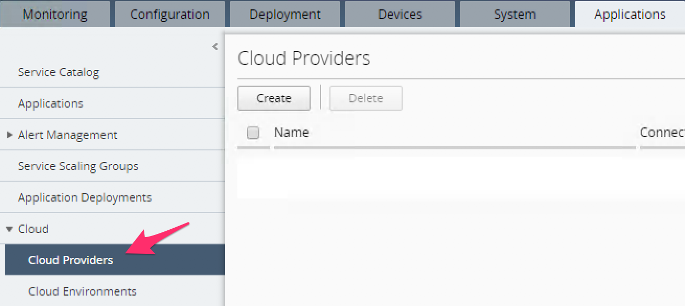
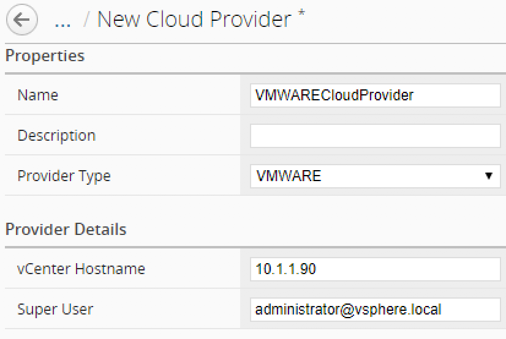
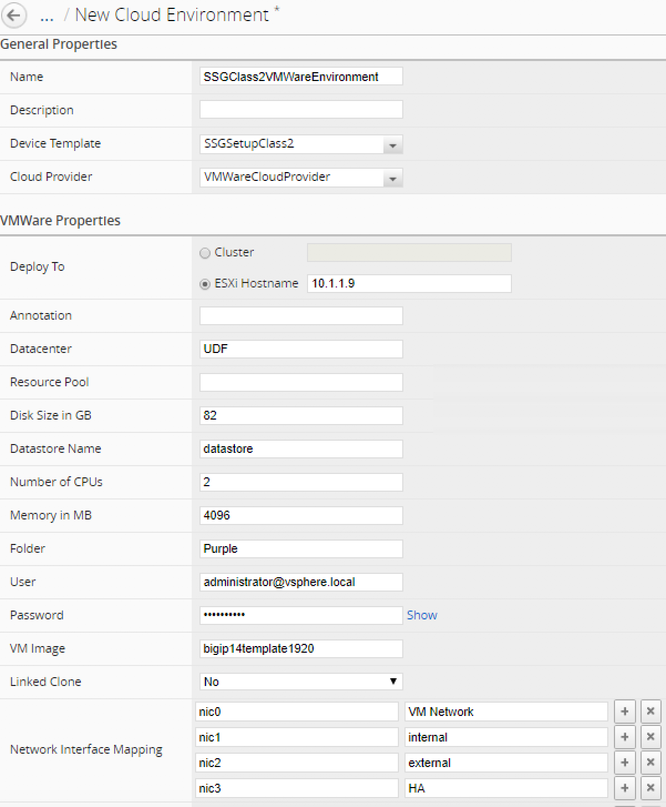

Lab 1.2: Define your Cloud Environment
--------------------------------------

The next step is to define your cloud environment so that BIG-IQ will be able
to communicate with it and deploy F5 virtual edition. For this lab we will
leverage a VMWare infrastructure

Cloud Provider Setup
********************

In your BIG-IQ interface, go to *Applications* > *Cloud* > *Cloud Providers*

|

Click on the *Create* button:

* Name: VMWareCloudProvider
* Provider Type: select *VMWARE*
* vCenter Hostname: 10.255.250.5
* Super User: administrator@vsphere.local

|

Click *Save & Close*. Now that your Cloud provider is setup, we can define your
``Cloud Environments``. Go to *Applications* > *Cloud* > *Cloud Environments*
and click on the *Create* button

General Properties:

* Name: SSGClass2VMWareEnvironment
* Device Template: Select your previously created device template *SSGSetupClass2*
* Cloud Provider: Select your previously created Cloud provider *VMWareCloudProvider*

VMWare Properties:

* DeployTo: Select *ESXi Hostname* and type: 10.1.1.9
* Datacenter: UDF
* Folder: Purple
* Disk Size in GB: 82
* Datastore Name: datastore
* Number of CPUs: 2
* Memory in MB: 4096
* User: administrator@vsphere.local
* Password: Purpl3$lab
* VM Image:bigip14template1920
* Network Interface Mappings

  ========================== ===================
      Network Interface            Network
  ========================== ===================
          nic0                    VM Network
          nic1                      internal
          nic2                      external
          nic3                        HA
  ========================== ===================

|

Click *Save & Close*

We have setup all the different element defining our ``Service Scaling Group``
and can trigger its deployment now
