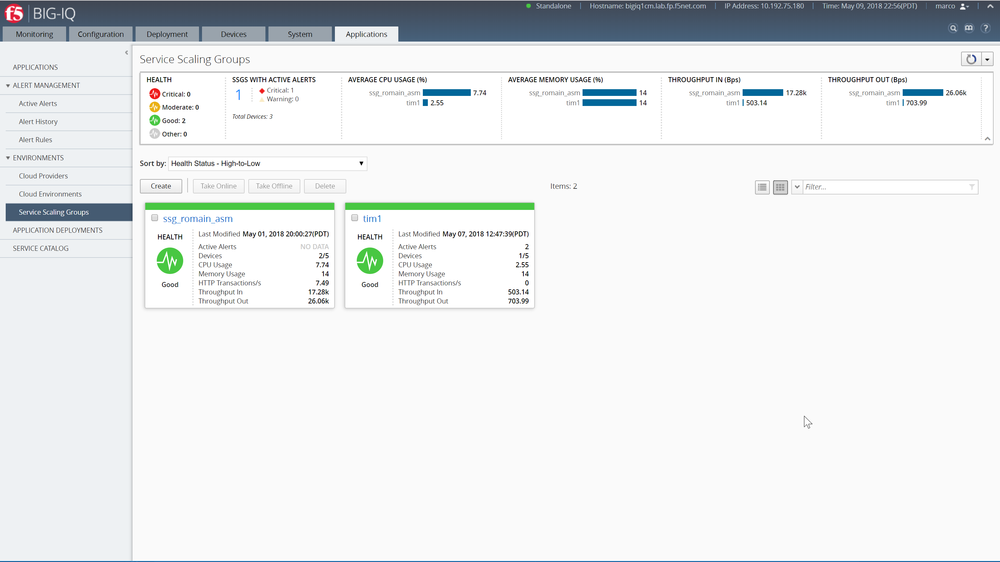
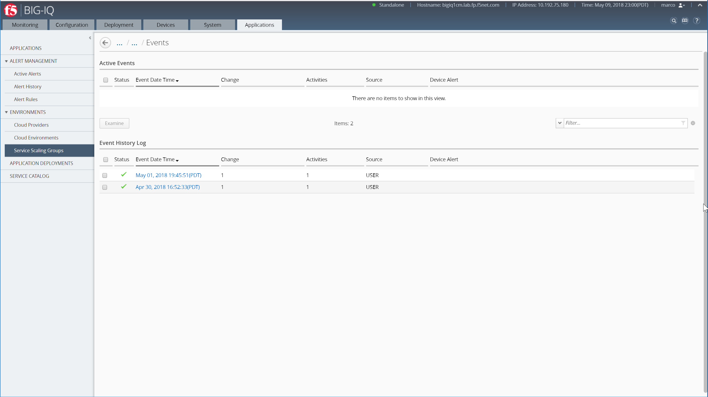

Lab 3.1: General Views and Configuration SSG
--------------------------------------------
Connect as **Marco**.
Go to *ENVIRONMENT* > *Service Scaling Groups*:

The screen lists all of your service scaling groups (SSG) and current summary data about their overall health, BIG-IP device performance and active alerts. Use this screen to create, delete, or oversee all of your SSGs.

Summary Bar provides summary information about your SSGs' overall health, active alerts and device performance. Click the elements in this area to filter or sort the SSG list.

SSGs with Active AlertsLists the number of SSGs with either active warning or critical alerts.

Overall Device Performance:Lists the top 5 SSGs for each performance data indicator.

The screen lists all SSGs in either in a grid or tile mode. From here, you can create, delete or monitor your SSGs.
Use one of the screen's filter and sort settings to isolate information of interest. You can adjust the columns displayed by selecting the gear icon in the filter area.

Select the SSG name to redirect you to a more detailed dashboard.

**Analytics Tab**

Use this area to identify data trends and events, or alerts, within a selected time period. To further isolate information, expand the dimensions area to the right of the chart.
Select specific entities within each dimension to adjust the data displayed in this tab. To view specific alert details, select an in-line notification, or choose one of the filters below each chart.

Take the time to naviate in all the different charts.

.. image:: ../pictures/module3/img_module3_lab1_2.png
  :align: center
  :scale: 50%

**Configuration Tab**

Use this area to edit your SSG's properties and to view the configuration and status of each object connected to your SSG.

.. image:: ../pictures/module3/img_module3_lab1_3.png
  :align: center
  :scale: 50%

.. note:: Go to Class 2 for more information about SSG.

On the top right of the window, Click on the **Scaling History** button to have more

.. image:: ../pictures/module3/img_module3_lab1_4.png
  :align: center
  :scale: 50%

Applications are listed in order of Application Name. You can sort applications by clicking in the column header, or filter, by using key words.
To redirect you to the individual application dashboard, select the application name.

